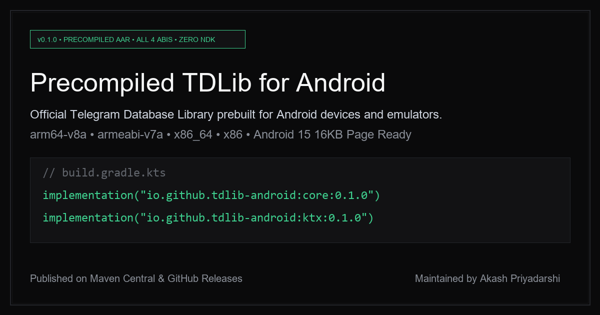

<p align="center">
  
</p>

<h1 align="center">tdlib-android</h1>

<p align="center">
  <strong>Precompiled TDLib for Android across all 4 ABIs. Zero local NDK. Zero source compile.</strong>
</p>

<p align="center">
  <a href="https://central.sonatype.com/artifact/io.github.tdlib-android/core"></a>
  <a href="https://tdlib-android.vercel.app"></a>
  <a href="https://github.com/AkashPriyadarshii/tdlib-android/releases"></a>
  <a href="https://github.com/AkashPriyadarshii/tdlib-android/actions"></a>
  <a href="LICENSE"></a>
  <a href="https://developer.android.com"></a>
  <a href="https://github.com/AkashPriyadarshii/tdlib-android"></a>
  <a href="https://tdlib-android.vercel.app/setup"></a>
</p>

<p align="center">
  <a href="https://tdlib-android.vercel.app">
    
  </a>
</p>

Precompiled [TDLib](https://github.com/tdlib/td) (Telegram Database Library) for Android. Packaged as standalone Android Archive (AAR) binaries for all 4 native architectures, built in CI, and paired with a Kotlin Coroutines and Flow wrapper.

No compiling C++ from source. No Android NDK wrangling. Works with any Telegram client, bot frontend, cloud storage bridge, or MTProto Android application.

> **Documentation Site:** Setup guides and architecture notes available at [tdlib-android.vercel.app](https://tdlib-android.vercel.app/).
>
> **For AI Coding Agents:** Point your agent to [`https://tdlib-android.vercel.app/llms.txt`](https://tdlib-android.vercel.app/llms.txt) or [`llms-full.txt`](https://tdlib-android.vercel.app/llms-full.txt) for token-efficient API and Gradle context.

---

## Key Features

- **All 4 Android ABIs Included:** `arm64-v8a`, `armeabi-v7a`, `x86_64`, `x86`.
- **Android 15 (16KB Page Size) Compatible:** Built with 16KB page alignment (`-Wl,-z,max-page-size=16384`) ensuring forward compatibility across Pixel 8/9 and modern Android devices.
- **Zero Local Compilation:** Eliminates 30+ minute C++ compile times and out-of-memory crashes on developer workstations.
- **Coroutines & Flow First (`:ktx`):** Thin Kotlin bridge with `suspend fun send()` and reactive `Flow<Update>` update streams.
- **Built-in Proguard / R8 Rules:** Ships with consumer rules (`consumer-rules.pro`) preventing code shrinkers from stripping native JNI entry points.
- **Automated Upstream Tracking:** Scheduled CI monitors upstream `tdlib/td` releases and builds fresh AARs on new versions.
- **Strict ELF Validation:** Every binary is verified via `readelf -h` architecture checks before packaging.

---

## Architecture & Data Flow

```text
+-------------------------------------------------------------+
|                     Android Application                     |
|            (Jetpack Compose / XML / ViewModels)             |
+-------------------------------------------------------------+
                              |
                              v
+-------------------------------------------------------------+
|                 tdlib-android:ktx Module                    |
|   - TdClient (Lifecycle, CoroutineScope)                    |
|   - suspend fun send(Function<T>): T                        |
|   - SharedFlow<Update> (Stateless, Unlimited Buffer)        |
+-------------------------------------------------------------+
                              |
                              v
+-------------------------------------------------------------+
|                 tdlib-android:core Module                   |
|   - Java JNI Glue (Client.java, TdApi.java)                 |
|   - Prebuilt libtdjni.so (Embedded for 4 ABIs)              |
+-------------------------------------------------------------+
                              |
                              v
+-------------------------------------------------------------+
|                   Telegram MTProto Gateway                  |
+-------------------------------------------------------------+
```

---

## Ecosystem Comparison

Why this repository exists compared to historical and abandoned alternatives:

| Solution | Active | ABIs | Kotlin Flow | Auth/NDK Required |
| :--- | :--- | :--- | :--- | :--- |
| **tdlib-android (This Project)** | **Yes (2026)** | **4 ABIs (arm64, armv7, x86_64, x86)** | **Yes (`:ktx`)** | **Zero (Precompiled AAR)** |
| `up9cloud/android-libtdjson` | Frozen (v1.8.52) | Partial | No (Java only) | GitHub Token + Raw `.so` |
| `TGX-Android/tdlib` | Internal only | Varies | No | Forked private API |
| `tdlibx/td-ktx` | Dead (Archived 2024) | Incomplete | Partial | Broken dependencies |
| `g000sha256/tdl-coroutines` | Inactive | 3 ABIs | Yes | Broken build path |
| Local NDK Build | Manual | Manual | No | High RAM + Long compile times |

---

## Installation
 
### Option 1: Maven Central (Recommended)
 
Add the prebuilt TDLib artifacts directly from Maven Central:
 
```kotlin
// settings.gradle.kts
dependencyResolutionManagement {
    repositories {
        google()
        mavenCentral()
    }
}

// app/build.gradle.kts
dependencies {
    // Core prebuilt TDLib with 4 ABIs + Java JNI classes
    implementation("io.github.tdlib-android:core:0.1.0")

    // Kotlin Coroutines & Flow wrapper
    implementation("io.github.tdlib-android:ktx:0.1.0")
}
```

### Option 2: Direct AAR Download (GitHub Releases / Offline)

Download precompiled artifacts from the [latest release](https://github.com/AkashPriyadarshii/tdlib-android/releases/latest):

- `core-release.aar` : Native TDLib binary for all 4 ABIs (~39 MB)
- `ktx-release.aar` : Kotlin Coroutines & Flow wrapper (~44 KB)
- `checksums.txt` : SHA-256 integrity checksums

Place the `.aar` files in your project's `app/libs/` directory:

```kotlin
// settings.gradle.kts
dependencyResolutionManagement {
    repositories {
        google()
        mavenCentral()
        flatDir { dirs("libs") }
    }
}

// app/build.gradle.kts
dependencies {
    implementation(files("libs/core-release.aar"))
    implementation(files("libs/ktx-release.aar"))
    implementation("org.jetbrains.kotlinx:kotlinx-coroutines-android:1.8.1")
}
```

---

## Usage Guide

### 1. Initialize Native Client

Load the native JNI library and instantiate `TdClient` with your application directory and API credentials:

```kotlin
import io.github.tdlibandroid.ktx.TdClient
import io.github.tdlibandroid.ktx.awaitReady
import io.github.tdlibandroid.ktx.updatesOf
import kotlinx.coroutines.CoroutineScope
import kotlinx.coroutines.Dispatchers
import kotlinx.coroutines.launch
import org.drinkless.tdlib.TdApi

// 1. Load prebuilt native binary
System.loadLibrary("tdjni")

// 2. Instantiate client
val filesDir = context.filesDir.absolutePath + "/tdlib"
val client = TdClient(
    filesDir = filesDir,
    verbosityLevel = 1,                      // 0=Fatal, 1=Error, 2=Warn, 5=Debug
    apiId = YOUR_TELEGRAM_API_ID,           // From https://my.telegram.org
    apiHash = "YOUR_TELEGRAM_API_HASH"
)

// 3. Initialize background worker
client.init()
```

### 2. Collect Real-Time Updates

Listen to incoming Telegram updates reactively using Kotlin Flows:

```kotlin
CoroutineScope(Dispatchers.IO).launch {
    // Collect all updates
    client.updates.collect { update ->
        when (update) {
            is TdApi.UpdateNewMessage -> {
                println("New message received: ${update.message.id}")
            }
            is TdApi.UpdateConnectionState -> {
                println("Connection state: ${update.state}")
            }
        }
    }
}
```

### 3. Filter Specific Update Types

Use `updatesOf<T>()` for clean type-safe subscriptions:

```kotlin
CoroutineScope(Dispatchers.IO).launch {
    client.updatesOf<TdApi.UpdateNewMessage>().collect { update ->
        val message = update.message
        val content = message.content
        if (content is TdApi.MessageText) {
            println("Text: ${content.text.text}")
        }
    }
}
```

### 4. Send Requests (Suspend Functions)

Dispatch requests asynchronously and receive typed results:

```kotlin
CoroutineScope(Dispatchers.IO).launch {
    try {
        // Wait until client completes handshake
        client.awaitReady()

        // Fetch TDLib version
        val response = client.send(TdApi.GetOption("version"))
        if (response is TdApi.OptionValueString) {
            println("Connected to TDLib version: ${response.value}")
        }

        // Fetch current user info
        val me = client.send(TdApi.GetMe())
        println("Logged in as: ${me.firstName} (@${me.usernames?.activeUsernames?.firstOrNull()})")

    } catch (e: TdException) {
        if (e.isFloodWait) {
            println("Rate limited: retry after ${e.floodWaitSeconds} seconds")
        } else if (e.isUnauthorized) {
            println("Session expired or unauthorized")
        } else {
            println("TDLib Error [${e.code}]: ${e.message}")
        }
    }
}
```

### 5. Track File Downloads / Uploads

Track file transfer progress reactively:

```kotlin
CoroutineScope(Dispatchers.IO).launch {
    client.trackFile(fileId = 12345).collect { file ->
        val downloaded = file.local.downloadedSize
        val total = file.expectedSize
        val percent = if (total > 0) (downloaded * 100 / total) else 0
        println("Download progress: $percent% ($downloaded / $total bytes)")
    }
}
```

### 6. Clean Up on App Destruction

Release native pointers and cancel active coroutine scopes:

```kotlin
override fun onDestroy() {
    super.onDestroy()
    client.close()
}
```

---

## ABI Support Matrix

| ABI | Architecture | Target Devices | Real-World Verified |
| :--- | :--- | :--- | :--- |
| **`arm64-v8a`** | AArch64 (64-bit ARM) | Modern Android devices (2016+) | Realme GT 7 (Dimensity 9400e), Pixel 8 |
| **`armeabi-v7a`** | ARMv7 (32-bit ARM) | Legacy / budget Android phones | Verified via readelf |
| **`x86_64`** | AMD64 / Intel 64-bit | Android Studio emulators & ChromeOS | Android 14 / 15 / 16 Emulators |
| **`x86`** | i686 (32-bit x86) | Legacy emulators & embedded hardware | Verified via readelf |

---

## Proguard & R8 Configuration

`core-release.aar` automatically bundles `consumer-rules.pro`:

```proguard
-keep class org.drinkless.tdlib.** { *; }
-dontwarn org.drinkless.tdlib.**
```

No manual ProGuard or R8 rules required in consuming application modules.

---

## CI/CD Infrastructure

The repository runs completely automated cloud builds using GitHub Actions:

- **Dockerized Matrix Builds:** Cross-compiles OpenSSL and TDLib with Android NDK across 4 independent runner jobs.
- **10GB Swap Space:** Prevents compiler OOM during heavy template instantiation.
- **Fail-Fast Gates:** If any ABI compilation fails, the release pipeline aborts to prevent shipping partial binary sets.
- **Automated Checksums:** SHA-256 hashes generated and verified for all output binaries.

---

## License

- **TDLib Native Code & Java Bindings (`:core`):** [Boost Software License 1.0 (BSL-1.0)](LICENSE-BSL) ([Upstream](https://www.boost.org/LICENSE_1_0.txt)).
- **Kotlin Wrapper Module (`:ktx`):** [Apache License 2.0](LICENSE-APACHE).
- See the consolidated [LICENSE](LICENSE) file for full terms.

---

## Community & Security

- **Security Advisories:** Review our [Security Policy](SECURITY.md) to report vulnerabilities privately.
- **Code of Conduct:** Read our [Code of Conduct](CODE_OF_CONDUCT.md) for community standards.
- **Contributing:** Check [CONTRIBUTING.md](CONTRIBUTING.md) for build constraints and workflow architecture.

---

## Author & Maintainer

Maintained by **[Akash Priyadarshi (@AkashPriyadarshii)](https://github.com/AkashPriyadarshii)**. Built to provide reliable, zero-friction TDLib native distribution for the Android developer community.
